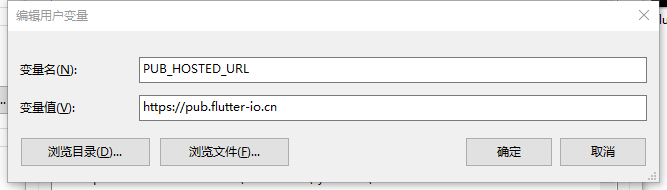
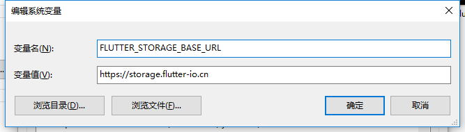

<h1 align="center">Flutter 配置详解</h1>

* [Flutter 官方文档](https://flutter.dev/docs)
* [Flutter 中文文档](https://flutter-io.cn/docs)
* [Github 地址](https://github.com/flutter/flutter)
```
// 拉取flutter，选择stable分支
// 拉取过程经常会出现失败，拉取成功后会自动安装dart，不用单独安装
$ git clone -b stable https://github.com/flutter/flutter.git
```
> 拉取成功后需要配置环境变量  D:\application\flutter\bin  


```
$ flutter --version
$ flutter doctor
// 由于那啥，执行flutter doctor总是执行失败，所以需配置临时镜像
// 打开环境变量配置
PUB_HOSTED_URL  =  https://pub.flutter-io.cn
FLUTTER_STORAGE_BASE_URL  =  https://storage.flutter-io.cn
```


* 接受协议
```
$ flutter doctor --android-licences
```
* 运行flutter doctor是否成功
```
$ flutter doctor
```

* 列出可使用的设备
```
$ flutter emulators
```
* 打开指定的模拟器
```
$ flutter emulators --launch Nexus_5X_API_28
// flutter emulators --launch <模拟器的名称>
```
* 创建项目
```
$ flutter create <project name>
// flutter create flutter_demo
```
* 启动
```
$ flutter run
// 或者编制器中直接启动，启动过程需要Initializing gradle...
// 编辑器中启动可以热更新
```
